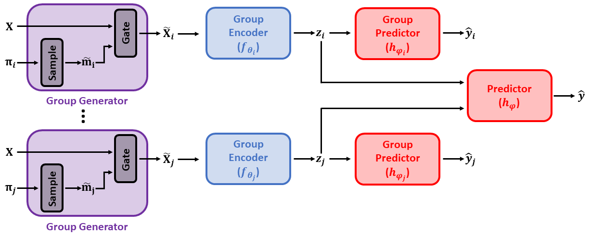

# Composite-Feature-Selection
[](https://github.com/a-norcliffe/Composite-Feature-Selection/blob/master/LICENSE)
[](https://www.python.org/downloads/release/python-370/)

Official code for the NeurIPS 2022 paper [**Composite Feature Selection using Deep Ensembles**](https://github.com/a-norcliffe/Composite-Feature-Selection)
(
[Fergus Imrie](https://fimrie.github.io/),
[Alexander Norcliffe](https://twitter.com/alexnorcliffe98), 
[Pietro Liò](https://www.cl.cam.ac.uk/~pl219/),
[Mihaela van der Schaar](https://www.vanderschaar-lab.com/prof-mihaela-van-der-schaar/)
)

Current feature selection methods only return a list of predictive features. However, features often don't act alone, but with each other. Take XOR as a simple example, feature 1 *literally* provides
no information without also knowing the value of feature 2 and vice versa. This work aims to solve the problem of **Composite Feature Selection**, where we find the groups of features that act together. 


*Our model CompFS. We use an ensemble of group selection models to discover
composite features and an aggregate predictor to combine these features when issuing predictions.*


## Abstract 

In many real world problems, features do not act alone but in combination with each other. 
For example, in genomics, diseases might not be caused by any single mutation but require the presence of multiple mutations. 
Prior work on feature selection either seeks to identify individual features or can only determine relevant groups from a predefined set. 
We investigate the problem of discovering groups of predictive features without predefined grouping. 
To do so, we define predictive groups in terms of linear and non-linear interactions between features. 
We introduce a novel deep learning architecture that uses an ensemble of feature selection models to find predictive groups, without requiring candidate groups to be provided.
The selected groups are sparse and exhibit minimum overlap.
Furthermore, we propose a new metric to measure similarity between discovered groups and the ground truth.
We demonstrate the utility of our model on multiple synthetic tasks and semi-synthetic chemistry datasets, where the ground truth structure is known, as well as an image dataset and a real-world cancer dataset.


*The novel regularisation component of the loss function. The first term makes groups small, the second term makes groups different.*


*Our new metric for determining similarity between sets of discovered group features. Our metric is based on a normalized Jaccard similarity between the ground truth and the discovered groups.*


## Getting Started

### Installing Packages
We used `python 3.7` for this project. To setup the virtual environment and necessary packages, please run the following commands:
```bash
$ conda create --name compfs python=3.7
$ conda activate compfs
$ pip install -r requirements.txt
```
`PyTorch 1.4.0` is also required, which can be installed from the [official website](https://pytorch.org/).

### Datasets
The datasets have not been included here to save space. Download each dataset and place in the following folders:
- Chemisty Data: [Link](https://github.com/google-research/graph-attribution/raw/main/data/all_16_logics_train_and_test.zip), store data in *datasets/chem_data/* (copy and paste from the 'all_16_logics_train_and_test' folder)
- Metabric Data: [Link](https://www.kaggle.com/datasets/raghadalharbi/breast-cancer-gene-expression-profiles-metabric), store data in *datasets/metabric_data/*

### Running the Experiments
Experiments can be run from the command line (from the home directory), with the arguments: experiment_no, experiment, model, for example:

```
$ python -m experiments.run_experiment --experiment_no 1 --experiment syn1 --model compfs1
$ python -m experiments.run_experiment --experiment_no 6 --experiment chem3 --model ensemble_stg
$ python -m experiments.run_experiment --experiment_no 2 --experiment metabric --model compfs
$ python -m experiments.run_experiment --experiment_no 1 --experiment mnist --model gbdt
```

Following that, the standard evaluation to produce the tables from the paper may be carried out from the command line (from the home directory), with the arguments: experiment, model, for example:

```
$ python -m experiments.run_evaluation --experiment syn4 --model lasso
$ python -m experiments.run_evaluation --experiment chem1 --model random_forests
$ python -m experiments.run_evaluation --experiment chem2 --model oracle
```

For Group Lasso, STG and Concrete Autoencoder we have included Python Notebooks in the experiments/notebooks/ folder to be run. Included are also notebooks for the MNIST evaluation. STG may also be run from the command line using the
same commands as above, with model command line argument `stg`, however this is an adapted Ensemble STG with one STG so the hyperparameters have been adjusted accordingly to obtain the same positive results.

### Running CompFS on your Data
We have included a notebook in the home directory, 'example.ipynb', which demonstrates CompFS on Syn1. Here the data can be easily be replaced with NumPy arrays of custom data, and the hyperparameters of CompFS can be set. The notebook
'standalone_example.ipynb' is the same notebook but with code copied directly rather than imported so that it can be used on without requiring imports from the repo.


## Citation
If our paper or code helped you in your own research, please cite our work as:
```
@article{imrie2022compfs,
  title={{C}omposite {F}eature {S}election using {D}eep {E}nsembles},
  author={Imrie, Fergus and Norcliffe, Alexander and Li{\`o}, Pietro and van der Schaar, Mihaela},
  journal={Advances in Neural Information Processing Systems},
  volume={35},
  year={2022}
}
```

## Acknowledgements
We thank the anonymous reviewers for their comments and suggestions for this paper.
At the time of this work, Fergus Imrie and Mihaela van der Schaar are supported by the National Science Foundation (NSF, grant number 1722516).
Mihaela van der Schaar is additionally supported by the Office of Naval Research (ONR). Alexander Norcliffe is supported by a GlaxoSmithKline grant.
We would also like to thank Bogdan Cebere and Evgeny Saveliev for reviewing this code. 
